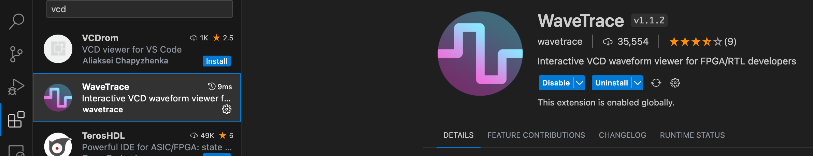
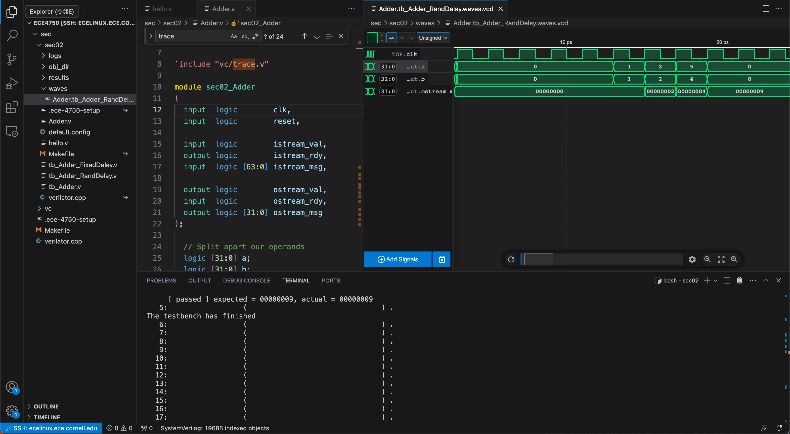
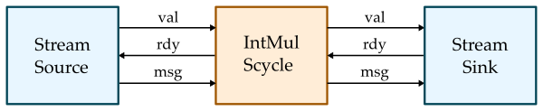

ECE 4750 Section 3: RTL Testing with Verilator
==========================================================================

 - Author: Cecilio C. Tamarit
 - Date: September 7, 2023
 - Inspired by previous ECE 4750 material

**Table of Contents**

 - Overview of Testing Strategies
 - Testing with Stream Sources and Sinks
 - Testing with Verilator + gcov/lcov
 - Examining Coverage Reports
 - Using Functional-Level Models

This discussion section serves as gentle introduction to the basics of
RTL testing using Verilator and gcov/lcov. We will also tackle concepts
such as:

 - Ad-Hoc vs. Assertion Testing
 - Directed vs. Random Testing
 - Black-Box vs. White-Box Testing
 - Value vs. Delay Testing
 - Unit vs. Integration Testing
 - Reference Models

Start by logging into the `ecelinux` servers using the remote access option 
of your choice and then source the setup script. We can then reuse the
setup from last week. Make sure you `make clean` if your directory from last 
week already exists:

Make sure you `make clean` if your directory from last week already exists:
    
    % cd $HOME/ece4750/sec/sec02
    % make clean

If it _doesn't_ exist, we can set it up again:

    % source setup-ece4750.sh
    % mkdir -p $HOME/ece4750/sec
    % cd $HOME/ece4750/sec
    % TOPDIR=$PWD
    % wget https://github.com/cornell-ece4750/ece4750-sec02-verilog/raw/m3/docs/sec02.tar.gz
    % tar xvf sec02.tar.gz
    % rm sec02.tar.gz
    % make setup
    % cd $TOPDIR/sec02

### Pro tip: VCD format and waveform visualization in VSCode

While GTKWave suits the needs of this class, VSCode users
will benefit from storing waveforms in the VCD format (as
opposed to FST). Several VCD visualization plug-ins exist
and can be installed right from VSCode, such as the one shown
below. This circumvents the need to resort to X11 or X2Go.

However, we still need to modify `$TOPDIR/sec02/verilator.cpp`
so that we generate VCD files instead of FST files in the `waves`
folder. First, by including the right header at the top:

    ...
    #include "verilated_vcd_c.h"
    ...

Then, by modifying lines ~77-92 as follows:

    Verilated::debug(0);
    Verilated::randReset(2);
    Verilated::traceEverOn(true);
    Verilated::commandArgs(argc, argv);
    Verilated::mkdir("logs");
    const std::unique_ptr<VerilatedContext> contextp{new VerilatedContext};
    Verilated::traceEverOn(true);
    Vtop* top = new Vtop{contextp.get(), "TOP"};  // Or use a const unique_ptr, or the VL_UNIQUE_PTR wrapper
      //svSetScope (svGetScopeFromName("Vtop.v"));
    VerilatedVcdC* tfp = new VerilatedVcdC;
    Verilated::traceEverOn(true);
    if(waves){
        top->trace(tfp, 99);  // Trace 99 levels of hierarchy
        Verilated::mkdir("waves");
        tfp->open((std::string("waves/")+outname +"waves.vcd").c_str());
    }

Lastly, defying course policy, edit the Makefile at 
`$TOPDIR/sec02/Makefile` so that line 88 becomes:

    VERILATOR_FLAGS += --trace

If you proceed to cleaning, regenerating, and running the testbench,
you will now find the VCD files in the `waves` folder. If you click
on any of them, the corresponding plug-in should launch. You should now
have a phenomenal 3-tile workflow set up! You can edit your Verilog
code, verilate, and debug it, all in the same window.

Ad-Hoc vs. Assertion Testing
--------------------------------------------------------------------------

Now let's get back to testing the simple single-cycle adder we developed
in last week's discussion:

As a reminder, here is the interface for our latency-insensitive adder:

    module sec02_Adder
    (
     input  logic        clk,
     input  logic        reset,
       
     input  logic        istream_val,
     output logic        istream_rdy,
     input  logic [63:0] istream_msg,
       
     output logic        ostream_val,
     input  logic        ostream_rdy,
     output logic [31:0] ostream_msg
    );

Our single-cycle multiplier takes two 32-bit input values and produces a
32-bit output value. Let's use the same ad-hoc test we used last week to
test this multiplier. Start by reviewing the Python test bench located in
`imul/imul-v1-adhoc-test.py`:

    from sys import argv

    from pymtl3  import *
    from pymtl3.passes.backends.verilog import *

    from IntMulScycleV1 import IntMulScycleV1

    # Get list of input values from command line

    in0_values = [ int(x,0) for x in argv[1::2] ]
    in1_values = [ int(x,0) for x in argv[2::2] ]

    # Create and elaborate the model

    model = IntMulScycleV1()
    model.elaborate()

    # Apply the Verilog import passes and the default pass group

    model.apply( VerilogPlaceholderPass() )
    model = VerilogTranslationImportPass()( model )
    model.apply( DefaultPassGroup(linetrace=True,textwave=True,vcdwave="imul-v1-adhoc-test") )

    # Reset simulator

    model.sim_reset()

    # Apply input values and display output values

    for in0_value,in1_value in zip(in0_values,in1_values):

      # Write input value to input port

      model.in0 @= in0_value
      model.in1 @= in1_value
      model.sim_eval_combinational()

      # Tick simulator one cycle

      model.sim_tick()

    # Tick simulator three more cycles and print text wave

    model.sim_tick()
    model.sim_tick()
    model.sim_tick()
    model.print_textwave()

The test bench gets some input values from the command line, instantiates
the design under test, applies some PyMLT3 passes, and then runs a
simulation by setting the input values and displaying the output value.
Let's run this ad-hoc test as follows:

    % cd $TOPDIR/build
    % python ../imul/imul-v1-adhoc-test.py 2 2 3 3

Experiment with different input values. Try large values that result in
overflow:

    % cd $TOPDIR/build
    % python ../imul/imul-v1-adhoc-test.py 70000 70000

In _ad-hoc testing_, we try different inputs and inspect the output
manually to see if the design under test produces the correct result.
This “verification by inspection” is error prone and not reproducible. If
you later make a change to your design, you would have to take another
look at the debug output and/or waveforms to ensure that your design
still works. If another member of your group wants to understand your
design and verify that it is working, he or she would also need to take a
look at the debug output and/or waveforms. Ad-hoc testing is usually
verbose, which makes it error prone and more cumbersome to write tests.
Ad-hoc testing is difficult for others to read and understand since by
definition it is ad-hoc. Ad-hoc testing does not use any kind of standard
test output, and does not provide support for controlling the amount of
test output. While using ad-hoc testing might be feasible for very simple
designs, it is obviously not a scalable approach when building the more
complicated designs we will tackle in this course.

The first step to improving our testing strategy is to use _assertion
testing_ where we explicitly write assertions that must be true for the
test to pass. This way we have made the checking for the correct results
systematic and automatic. Take a look at the simple Python test bench for
assertion testing located in `imul/imul-v1-assertion-test.py`:

    def test_basic():

      ... create and elaborate model ...
      ... apply Verilog import passes and the default pass group ...

      model.sim_reset()

      model.in0 @= 2
      model.in1 @= 2
      model.sim_tick()
      assert model.out == 0

    def test_basic():

      ... create and elaborate model ...
      ... apply Verilog import passes and the default pass group ...

      model.sim_reset()

      model.in0 @= 0x80000001
      model.in1 @= 2
      model.sim_tick()
      assert model.out == 0

    test_basic()
    test_overflow()

We have structured our assertion testing into a set of _test cases_. Each
test case is implemented as a Python function named with the prefix
`test_`. Each test case creates and elaborates the design under test,
applies appropriate passes, and resets the model. The test case then sets
the inputs to the model, ticks the simulator, and asserts that the output
of the model match the expected value. We explicitly call both test case
functions at the end of the script. Let's run this assertion test:

    % cd $TOPDIR/build
    % python ../imul/imul-v1-assertion-test.py

The first test case will fail since we have not specified the correct
expected value. Modify the assertion test script to have the correct
expected values for both test cases and then rerun the assertion test.

Testing with pytest
--------------------------------------------------------------------------

In this course, we will be using the powerful `pytest` unit testing
framework. The `pytest` framework is popular in the Python programming
community with many features that make it well-suited for test-driven
hardware development including: no-boilerplate testing with the standard
assert statement; automatic test discovery; helpful traceback and
failing assertion reporting; standard output capture; sophisticated
parameterized testing; test marking for skipping certain tests;
distributed testing; and many third-party plugins. More information is
available here:

 - <http://www.pytest.org>

It is pretty easy to adapt the assertion test script we already have to
make it suitable for use with `pytest`. Usually we like to keep all of
our tests in a dedicated `test` subdirectory. Take a look at the test
script `imul/test/IntMulScycleV1a_test.py`. It looks exactly like our
previous assertion test script with two changes:

 - we pass in `cmdline_opts` to each test case function
 - we do not need to explicitly call the test case functions at the bottom of the script

Let's use `pytest` to run this test:

    % cd $TOPDIR/build
    % pytest ../imul/test/IntMulScycleV1a_test.py

You can see that `pytest` has automatically discovered the two test
cases; `pytest` will assume any function that starts with the `test_`
prefix is a test case. The test cases will fail since we have not
specified the correct expected values. We can use the `-v` command line

    % cd $TOPDIR/build
    % pytest ../imul/test/IntMulScycleV1a_test.py -v

We can then "zoom in" on the first test case using the `-k` command line
option to run just that first test case:

    % cd $TOPDIR/build
    % pytest ../imul/test/IntMulScycleV1a_test.py -v -k test_basic

Then we can use the `-s` option to display the line trace and the
`--dump-vcd` option to dump the VCD file.

    % cd $TOPDIR/build
    % pytest ../imul/test/IntMulScycleV1a_test.py -v -k test_basic -s --dump-vcd

Modify the test script to have the correct expected values for both test
cases and then rerun the test using `pytest`.

Testing with Test Vectors
--------------------------------------------------------------------------

Our testing so far requires quite a bit of boilerplate code. Every test
case must construct a model, elaborate that model, apply PyMTL3 passes,
and reset the simulator. For every cycle, the test case must set the
inputs, tick the simulator, and check the outputs. We can use the power
of Python to encapsulate much of this common functionality into a library
to simplify testing. PyMTL3 provides a `run_test_vector_sim` function
that makes it easy to write these kind of cycle-by-cycle tests where we
want to explicitly set inputs and check outputs every cycle. Take a look
at the test script `imul/test/IntMulScycleV1b_test.py`.

    def test_basic( cmdline_opts ):
      run_test_vector_sim( IntMulScycleV1(), [
        ('in0 in1 out*'),
        [ 2,  2,  '?'  ],
        [ 3,  2,   0   ],
        [ 3,  3,   0   ],
        [ 0,  0,   0   ],
      ], cmdline_opts )

    def test_overflow( cmdline_opts ):
      run_test_vector_sim( IntMulScycleV1(), [
        ('in0         in1 out*'),
        [ 0x80000001, 2,  '?'  ],
        [ 0xc0000002, 4,   0   ],
        [ 0x00000000, 0,   0   ],
      ], cmdline_opts )

The `run_test_vector_sim` takes three arguments: a design under test, the
test vector table, and the command line options. The first row in the
test vector table specifies the names of the input and output ports.
Output ports need to be indicated by adding a `*` suffix. The remaining
rows in the test vector table specify the inputs and the correct outputs
for every cycle. We can indicate we don't care about an output on a given
cycle with `?`. Notice how Python can make things very compact while at
the same time very readable. Let's use `pytest` to run this test:

    % cd $TOPDIR/build
    % pytest ../imul/test/IntMulScycleV1b_test.py -s -v

The test cases will fail since we have not specified the correct expected
values. Modify the test script to have the correct expected values for
both test cases and then rerun the test using `pytest`. Use the `-v` and
`-s` options and notice that the line trace roughly corresponds to the
test vector table.

But wait there is more! We can use the `pytest.mark.parametrize`
decorator to parameterize a single test case over many different
parameters. In other words, instead of explicitly defining two test case
functions, we can _generate_ two test case functions from a single
specification. Take a look at the test script
`imul/test/IntMulScycleV1c_test.py`.

    basic_test_vectors = [
      ('in0 in1 out*'),
      [ 2,  2,  '?'  ],
      [ 3,  2,   0   ],
      [ 3,  3,   0   ],
      [ 0,  0,   0   ],
    ]

    overflow_test_vectors = [
      ('in0         in1 out*'),
      [ 0x80000001, 2,  '?'  ],
      [ 0xc0000002, 4,   0   ],
      [ 0x00000000, 0,   0   ],
    ]

    @pytest.mark.parametrize( "test_vectors", [
      basic_test_vectors,
      overflow_test_vectors
    ])
    def test_overflow( test_vectors, cmdline_opts ):
        run_test_vector_sim( IntMulScycleV1(), test_vectors, cmdline_opts )

Here we define test vector tables and then we use those test vector
tables in the `pytest.mark.parametrize` decorator. In this specific
example it does not save too much boiler plate, but we will see in the
next section how this is a very powerful way to generate test cases.
Modify the test script to have the correct expected values for both test
cases and then rerun the test using `pytest`. Use the `-v` and `-s`
options and notice that the output is basically the same as if we have
explicitly defined two test cases.

    % cd $TOPDIR/build
    % pytest ../imul/test/IntMulScycleV1c_test.py -s -v

Testing with Stream Sources and Sinks
--------------------------------------------------------------------------

So far we have been testing a latency-sensitive design. We write the
inputs on one cycle and then the result is produced after exactly one
cycle. In this course, we will make extensive use of latency-insensitive
streaming interfaces. Such interfaces use a val/rdy micro-protocol which
will enable other logic to always function correctly regardless of how
many cycles a component requires. Here is how we can implement a
single-cycle multiplier with a latency-insensitive streaming interface:

Here is the interface for this single-cycle multiplier:

    module imul_IntMulScycleV3
    (
      input  logic        clk,
      input  logic        reset,

      input  logic        istream_val,
      output logic        istream_rdy,
      input  logic [63:0] istream_msg,

      output logic        ostream_val,
      input  logic        ostream_rdy,
      output logic [31:0] ostream_msg
    );

Testing a latency-sensitive design requires using cycle-by-cycle testing,
but when testing a latency-insensitive design we can make use of stream
sources and sinks to both simplify our testing strategy and at the same
time ensure we can robustly test the flow control.

Take a look at the test script `imul/test/IntMulScycleV3a_test.py`.

    class TestHarness( Component ):

      def construct( s, imul, imsgs, omsgs ):

        # Instantiate models

        s.src  = StreamSourceFL( Bits64, imsgs )
        s.sink = StreamSinkFL  ( Bits32, omsgs )
        s.imul = imul

        # Connect

        s.src.ostream  //= s.imul.istream
        s.imul.ostream //= s.sink.istream

      def done( s ):
        return s.src.done() and s.sink.done()

      def line_trace( s ):
        return s.src.line_trace() + " > " + s.imul.line_trace() + " > " + s.sink.line_trace()

The test harness composes a stream source, the latency-insensitive
single-cycle multiplier, and a stream sink. When constructing the test
harness we pass in a list of input messages for the stream source to send
to the multiplier, and a list of output messages for the stream sink to
check against the messages received from the multiplier. The stream source
and sink take care of correctly handling the val/rdy micro-protocol. Here
is what a test case now looks like:

    def test_basic( cmdline_opts ):

      imsgs = [ mk_imsg(2,2), mk_imsg(3,3) ]
      omsgs = [ mk_omsg(4),   mk_omsg(9)   ]

      th = TestHarness( IntMulScycleV3(), imsgs, omsgs )
      run_sim( th, cmdline_opts, duts=['imul'] )

The test cases look a little different from the previous approach.
Instead of creating a test vector table, we now need to create the input
and output message list and pass them into the test harness. We can use
the `run_sim` function to handle applying PyMTL3 passes and actually
ticking the simulator. Let's use `pytest` to run this test:

    % cd $TOPDIR/build
    % pytest ../imul/test/IntMulScycleV3a_test.py -s -v

So far we have only been using directed testing, but random testing is of
course also very important to help increase our test coverage. Here is a
test case that randomly generates input messages and then calculates the
correct output messages:

    def test_random( cmdline_opts ):

      imsgs = []
      omsgs = []

      for i in range(10):
        a = randint(0,100)
        b = randint(0,100)
        imsgs.extend([ mk_imsg(a,b) ])
        omsgs.extend([ mk_omsg(a*b) ])

      th = TestHarness( IntMulScycleV3(), imsgs, omsgs )
      run_sim( th, cmdline_opts, duts=['imul'] )

You can use arbitrary Python to create a variety of random tests
sequences. Let's go ahead and run these random tests:

    % cd $TOPDIR/build
    % pytest ../imul/test/IntMulScycleV3b_test.py -s -v

In addition to testing the values, we also want to test that the
latency-sensitive single-cycle multiplier correctly implements the
val/rdy micro protocol. In other words, we want to make sure that the
design under test can handle arbitrary source/sink delays. The stream
source and sink components enable setting an `initial_delay` and a
`interval_delay` to help with this kind of _delay testing_. Here we set
the delay to be three cycles in the stream sink:

    def test_random_delay3( cmdline_opts ):

      imsgs = []
      omsgs = []

      for i in range(10):
        a = randint(0,100)
        b = randint(0,100)
        imsgs.extend([ mk_imsg(a,b) ])
        omsgs.extend([ mk_omsg(a*b) ])

      th = TestHarness( IntMulScycleV3(), imsgs, omsgs, 3 )
      run_sim( th, cmdline_opts, duts=['imul'] )

Let's go ahead and run these delay tests:

    % cd $TOPDIR/build
    % pytest ../imul/test/IntMulScycleV3c_test.py -s -v

Carefully compare the line trace to what we saw before without any
delays. Finally, we can use a test case table and the
`pytest.mark.parametrize` decorator to further simplify our test code.

    #-------------------------------------------------------------------------
    # mk_imsg/mk_omsg
    #-------------------------------------------------------------------------
    # Make input/output msgs, truncate ints to ensure they fit in 32 bits.

    def mk_imsg( a, b ):
      return concat( Bits32( a, trunc_int=True ), Bits32( b, trunc_int=True ) )

    def mk_omsg( a ):
      return Bits32( a, trunc_int=True )

    #-------------------------------------------------------------------------
    # test msgs
    #-------------------------------------------------------------------------

    basic_msgs = [
      mk_imsg(2,2), mk_omsg(4),
      mk_imsg(3,3), mk_omsg(9),
    ]

    overflow_msgs = [
      mk_imsg(0x80000001,2), mk_omsg(2),
      mk_imsg(0xc0000002,4), mk_omsg(8),
    ]

    random_msgs  = []
    for i in range(10):
      a = randint(0,100)
      b = randint(0,100)
      random_msgs.extend([ mk_imsg(a,b), mk_omsg(a*b) ])

    #-------------------------------------------------------------------------
    # Test Case Table
    #-------------------------------------------------------------------------

    test_case_table = mk_test_case_table([
      (                  "msgs          delay"),
      [ "basic",         basic_msgs,    0     ],
      [ "overflow",      overflow_msgs, 0     ],
      [ "random",        random_msgs,   0     ],
      [ "random_delay1", random_msgs,   1     ],
      [ "random_delay3", random_msgs,   3     ],
    ])

    #-------------------------------------------------------------------------
    # run tests
    #-------------------------------------------------------------------------

    @pytest.mark.parametrize( **test_case_table )
    def test( test_params, cmdline_opts ):

      imsgs = test_params.msgs[::2]
      omsgs = test_params.msgs[1::2]
      delay = test_params.delay

      th = TestHarness( IntMulScycleV3(), imsgs, omsgs, delay )
      run_sim( th, cmdline_opts, duts=['imul'] )

With a test case table, we can reuse the same input/output messages and
simply vary the delays. Let's try running the tests using this new
approach:

    % cd $TOPDIR/build
    % pytest ../imul/test/IntMulScycleV3d_test.py -s -v

Add a new row to the test case table that reuses the random messages but
with a delay of 10. Rerun the test case and look at the line trace to
verify the longer delays.

Using Functional-Level Models
--------------------------------------------------------------------------

One challenge with our testing strategy so far, is that when there is a
test failure we often don't know if the issue is an incorrect test case
or an incorrect design. It can be useful to have functional-level (FL)
model (also called a golden reference model) of our design. We can then
write all of our tests and ensure they pass on the FL model before
running those tests on our RTL design. We could also use our FL model in
random testing by sending the same inputs to both the FL and RTL models
and ensuring the outputs are equal.

FL models can be written in pure Python using PyMTL3. Here is a FL model
for our single-cycle multiplier.

    class IntMulFL( Component ):
      def construct( s ):

        # Interface

        s.istream = IStreamIfc( Bits64 )
        s.ostream = OStreamIfc( Bits32 )

        # Queue Adapters

        s.istream_q = IStreamDeqAdapterFL( Bits64 )
        s.ostream_q = OStreamEnqAdapterFL( Bits32 )

        s.istream //= s.istream_q.istream
        s.ostream //= s.ostream_q.ostream

        # FL block

        @update_once
        def block():
          if s.istream_q.deq.rdy() and s.ostream_q.enq.rdy():
            msg = s.istream_q.deq()
            s.ostream_q.enq( msg[32:64] * msg[0:32] )

Our FL model has the exact same interface as the RTL model. Normally, an
FL model just captures the _functional_ behavior of a model and does
_not_ attempt to capture any of the timing behavior. The above FL model
uses a combination of adapters and special PyMTL3 modeling constructs to
be able to express the function of our multiplier at a high level. We can
run all of our tests on our FL model like this:

    % cd $TOPDIR/build
    % pytest ../imul/test/IntMulFL_test.py -s -v

Since the FL model and RTL model have the exact same interface, it is
possible with clever Python programming to reuse the exact same tests
cases across both models. This means we can get all of our tests cases
working on the FL model, then directly reuse those test cases on the RTL
model, and be relatively confident that the test cases are correct.

Note that you can run all of the tests in the entire project like this:

    % cd $TOPDIR/build
    % pytest ../imul

