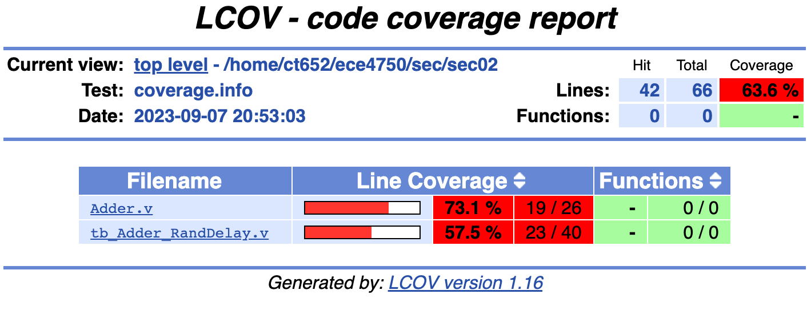
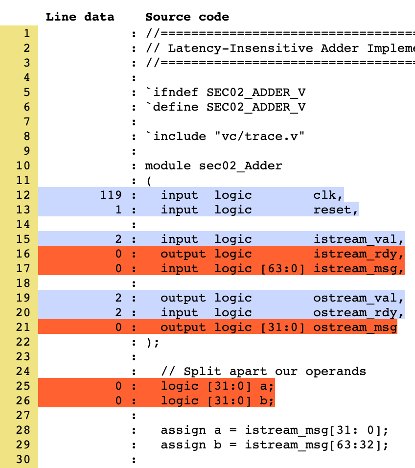
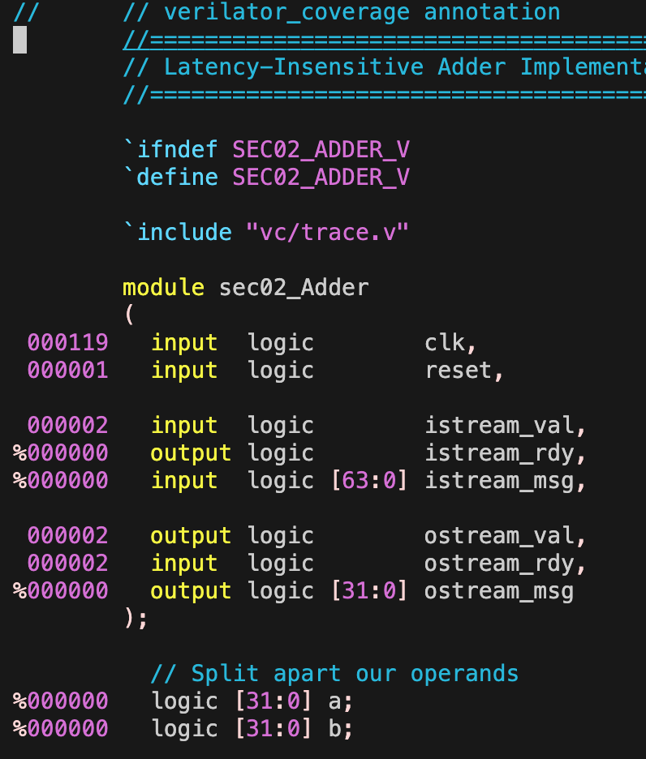

ECE 4750 Section 3: RTL Testing with Verilator
==========================================================================

 - Author: Cecilio C. Tamarit
 - Date: September 7, 2023
 - Inspired by previous ECE 4750 material

**Table of Contents**

 - VCD format and waveform visualization in VSCode
 - Overview of Testing Strategies
 - (Review: Testing with Stream Sources and Sinks)
 - Generating Coverage Reports with gcov/lcov

This discussion section serves as a gentle introduction to the basics of
RTL testing using Verilator and gcov/lcov. 

Start by logging into the `ecelinux` servers using the remote access option 
of your choice and then source the setup script. We can then reuse the
setup from last week. Make sure you `make clean` if your directory from last 
week already exists:

Make sure you `make clean` if your directory from last week already exists:
    
    % cd $HOME/ece4750/sec/sec02
    % make clean

If it _doesn't_ exist, we can set it up again:

    % source setup-ece4750.sh
    % mkdir -p $HOME/ece4750/sec
    % cd $HOME/ece4750/sec
    % TOPDIR=$PWD
    % wget https://github.com/cornell-ece4750/ece4750-sec02-verilog/raw/m3/docs/sec02.tar.gz
    % tar xvf sec02.tar.gz
    % rm sec02.tar.gz
    % make setup
    % cd $TOPDIR/sec02

## Pro tip: VCD format and waveform visualization in VSCode

While GTKWave suits the needs of this class, VSCode users
will benefit from storing waveforms in the VCD format (as
opposed to FST). Several VCD visualization plug-ins exist
and can be installed right from VSCode, such as the one shown
below. This circumvents the need to resort to X11 or X2Go.

However, we still need to modify `$TOPDIR/sec02/verilator.cpp`
so that we generate VCD files instead of FST files in the `waves`
folder. First, by including the right header at the top:

    ...
    #include "verilated_vcd_c.h"
    ...

Then, by modifying lines ~77-92 as follows to make use of the `VerilatedVcdC` class:

    Verilated::debug(0);
    Verilated::randReset(2);
    Verilated::traceEverOn(true);
    Verilated::commandArgs(argc, argv);
    Verilated::mkdir("logs");
    const std::unique_ptr<VerilatedContext> contextp{new VerilatedContext};
    Verilated::traceEverOn(true);
    Vtop* top = new Vtop{contextp.get(), "TOP"};  // Or use a const unique_ptr, or the VL_UNIQUE_PTR wrapper
      //svSetScope (svGetScopeFromName("Vtop.v"));
    VerilatedVcdC* tfp = new VerilatedVcdC;
    Verilated::traceEverOn(true);
    if(waves){
        top->trace(tfp, 99);  // Trace 99 levels of hierarchy
        Verilated::mkdir("waves");
        tfp->open((std::string("waves/")+outname +"waves.vcd").c_str());
    }

Lastly, defying course policy, edit the Makefile at 
`$TOPDIR/sec02/Makefile` so that line 88 becomes:

    VERILATOR_FLAGS += --trace

If you proceed to cleaning, regenerating, and running the testbench,
you will now find the VCD files in the `waves` folder. If you click
on any of them, the corresponding plug-in should launch. You should now
have a phenomenal 3-tile workflow set up! You can edit your Verilog
code, verilate, and debug it, all in the same window.

    % make tb_Adder_RandDelay.v DESIGN=Adder RUN_ARG=--trace

Overview of Testing Strategies
--------------------------------------------------------------------------

Now let's get back to testing the simple single-cycle adder we developed
in last week's discussion:

As a reminder, here is the interface for our latency-insensitive adder:

    module sec02_Adder
    (
     input  logic        clk,
     input  logic        reset,
       
     input  logic        istream_val,
     output logic        istream_rdy,
     input  logic [63:0] istream_msg,
       
     output logic        ostream_val,
     input  logic        ostream_rdy,
     output logic [31:0] ostream_msg
    );

- Again, anyone care to explain how this works?

In tb_Adder.v we had set up the following sample test cases:

    test_case( { 32'd1, 32'd1 },  32'd2 );
    test_case( { 32'd2, 32'd2 },  32'd4 );
    test_case( { 32'd4, 32'd5 },  32'd9 );

As a reminder, we can then run these tests as follows:

    % cd $TOPDIR/sec02
    % make tb_Adder_RandDelay.v DESIGN=Adder

Experiment with different input values. Try large values that result in
overflow:

    test_case( { 32'd1, 32'd1 },  32'd2 );
    test_case( { 32'd2, 32'd2 },  32'd4 );
    test_case( { 32'd4294967295, 32'd1 },  32'd4294967296 );

What we have been doing is a form of _assertion testing_ where we 
explicitly define input vectors and expected outputs so that the
testbench systematically determines whether any given test passes or fails.
This is as opposed to _ad-hoc testing_, in which case we also specify
the inputs, but then manually inspect the output (e.g. traces or waves)
to determine whether they reflect the expected behavior. The latter approach
is only truly feasible in the context of small modules, or as you know,
for debugging, but as designs increase in complexity it is of the utmost
importance that an automated testing process be in place. Being able to
replicate the original testing strategy will save us a significant amount 
of time if we expect this design to be modified (by others) in the future. 

To discuss in class: testing spectra

 - Ad-Hoc vs. Assertion Testing
 - Directed vs. Random Testing
 - Black-Box vs. White-Box Testing
 - Value vs. Delay Testing
 - Unit vs. Integration Testing
 - Reference Models

Generating Coverage Reports with gcov/lcov
--------------------------------------------------------------------------

To discuss in class:

- Drawing from your own experience with Lab 1, define "coverage."
- Why is test coverage such a big deal?

In our Makefile, we have included a series of commands that will generate
coverage reports _after your tests have been run_. This last part is important
to stress, and in fact we recommend that you `make clean` and rerun the
tests you are interested in before proceeding with generating the report. Not
cleaning can result in stale and essentially incorrect reports. Also note that
coverage information will only be obtained if we pass a valid input to the
`COVERAGE` parameter. For our previous example, we would dump coverage information and 
generate the report as follows:

    % make clean
    % make tb_Adder_RandDelay.v DESIGN=Adder RUN_ARG=--trace COVERAGE=coverage
    % make coverage-report

Here, `COVERAGE=coverage` can be replaced with `COVERAGE=coverage-line` or
`COVERAGE=coverage-toggle`.

To review in class:

- What was the difference between line and toggle coverage?

Running the aforementioned commands will populate your `logs` folder. Of particular
interest is the `coverage` subdirectory, which contains a report formatted in HTML.
You can simply download this folder with VSCode or MobaXterm by right-clicking on it
and selecting the appropriate option. This can then be opened with your web browser
of choice (e.g. Firefox.) Another option with VSCode is to make use of Microsoft's 
Live Preview plug-in.

If you are not a fan of GUIs, you can always check the same information in the
`annotated` subdirectory, where you will find the original code with the same
information in the left margin. For example:

    % cd $TOPDIR/sec02/logs/annotated
    % vim Adder.v

